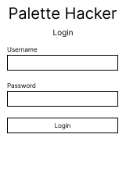

# Palette Hacker

## Overview

It's often the case when browsing the web that the color palette of a site is not what is desired. Sometimes, it could be late and the website's bright background hurts the eyes, or the website uses some red and green tints that make it difficult for users with Deuteranomaly to utilize.

Whatever the reason may be, Palette Hacker is a Chrome extension that allows you to modify the colors used in the CSS of a webpage. Color palette adjustments stay with the user, even if they leave and come back to a page. Users also have the option to submit the palette's they've made so other users can use the palette's they've created.

## Runbook

While this extension is not available on the Chrome Web store, the only way to run it is to deploy it locally to your own Chrome browser. Here are in the instructions to do so. You will still have accesses to the public database and endpoints as those are fully deployed.

1. `git clone` this project.
2. Navigate to [chrome://extensions/](chrome://extensions/) in Google Chrome
3. Click the 'Load Unpacked' button in the top left corner.
4. Navigate to the project's 'client' folder and select it.
5. Be sure that the extension is pinned in your extension manager in the top right corner of your broswer.

## Data Model

The application will store Users and Palettes.

* Users are identified by a unique userId generated and stored with Chrome. Each user can have many palette (references)
* Each palette contains information about the website, the swatches on the website, and the components and attributes those swatches apply to

An Example User:

```javascript
{
  userId: "ajfo932jfjfjzoifjzlkj3",
  palettes: [ // an array of references to Palette documents
    ObjectId(1249008104),
    ObjectId(0514958129)
  ]
}
```

An Example Palette:

```javascript
{
  website: "https://samplewebsite.com",
  name: "Dark Mode",
  palette: [
    {
      color: {
        red: 0,
        green: 0,
        blue: 0,
      },
      components: [
        {
          selector: "body>DIV",
          attribute: "background-color"
        }
      ]
    }
  ]
}
```

## [Link to Schema](./src/db.ts)

## Initial Wireframes

/ - page to modify the current palette


/\<domain\> - page displaying all the palettes published for this domain


/login - page to log in



/register - page to register a new user


/ (logged in) - page to modify the current palette for currently logged in users


/palettes - a page to view the currently logged in user's palettes


/palettes/\<palette_id\>/update - page to update the currently selected palette


## Initial Site map


## User Stories or Use Cases

1. As a user, I want to modify the color palette of the page I am currently on so that I can better interact with the site.
2. As a non-registered user, I want to keep the color palettes I have created before so that I don't have to make the same changes every time I come back to the site.
3. As a non-registered user, I want to see the color palettes that others have published so that I might not have to spend the time to create my own.
4. As a non-registered user, I want to create a new account so that I can publish my color palettes to other users.
5. As a registered user, I want to publish my palettes so that other users can use it on the same domain.
6. As a registered user, I want to view a list of my palettes so that I have quick access to the work I have created.
7. As a registered user, I want to edit my existing palettes so that other users can see an updated version of what I had created.
8. As a registered user, I want to delete my existing palettes so that palettes that I no longer want to use or have other people use do not polute the palettes available.

### Stretch Goals

1. As a user, I want to visualize the palette before pushing it onto the site so that I can view options before I commit to one.
2. As a user, I want to see which elements are affected by which CSS selector so that I know what elements I am changing before I start fiddling with the change.
3. As a user, I want to be able to search the palettes created for a webpage so that I can find one that matches the name or description of what I want.

## Research Topics

* (5 points) Chrome extensions
  * Ultimately, my web app will be a Google Chrome extension. This comes with its own API and a required Manifest doc to be written.
  * I have little to no experience in this area, and I expect it to be a bit of a learning curve.
  * To split it up, I would say writing the Manifest could be 2 points, setting up the content script listening was 3 points.
* (1 point) Postman
  * I've been making calls through Postman and have created a host of request types in a Postman project
  * I have next to no experience in Postman projects.
  * I've provided my Postman collection [here](palette_hacker.postman_collection.json)
* (2 point) Bootstrap
  * I have little experience with Bootstrap to style, but the experience was made slightly easier by the fact that my viewport is fixed.
  * Even still, styling took me more time than anticipated.
* (2 points) TypeScript
  * Using TypeScript to try my best to avoid `undefined` or `null` type errors.
  * I have some experience with TypeScript, but I've never had to set up the [tsconfig](tsconfig.json) or [nodemon config](nodemon.json) by hand before

## [Link to Initial Main Project File](./src/app.ts)

## [DevLog](./documentation/devlog.md)

## Annotations / References Used

1. [How To Set Up a Node Project With Typescript - Digital Ocean](https://www.digitalocean.com/community/tutorials/setting-up-a-node-project-with-typescript)
2. [Reading time - Chrome Developers](https://developer.chrome.com/docs/extensions/mv3/getstarted/tut-reading-time/)
3. [Methods to get unique values from arrays in Javascript and their performance - Phi Bya](https://dev.to/phibya/methods-to-get-unique-values-from-arrays-in-javascript-and-their-performance-1da8)
4. [Getting Unique ClientId from Chrome Extension - Rob W](https://stackoverflow.com/questions/23822170/getting-unique-clientid-from-chrome-extension)
